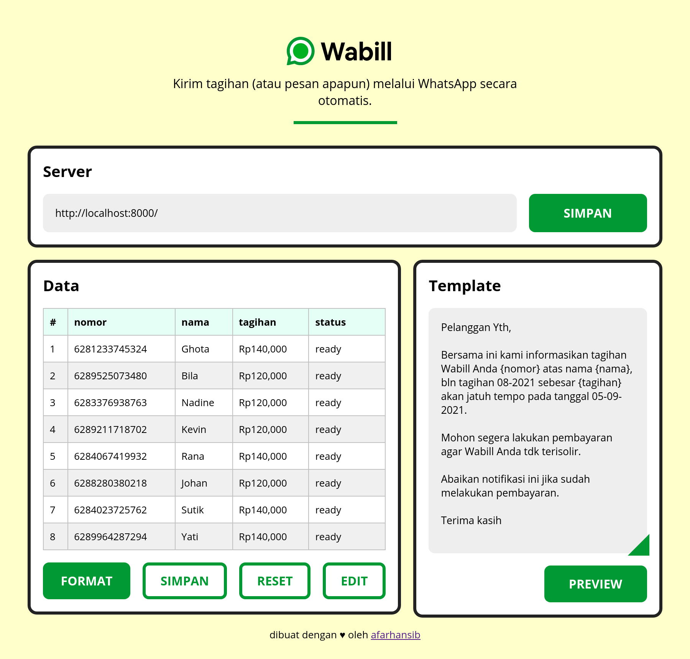
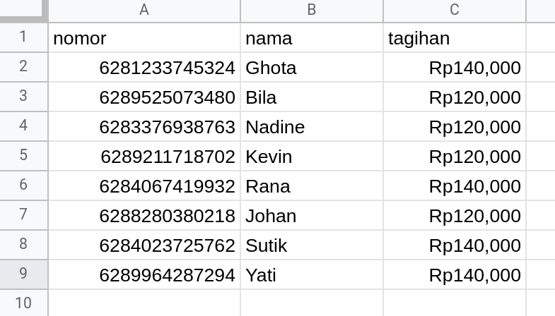
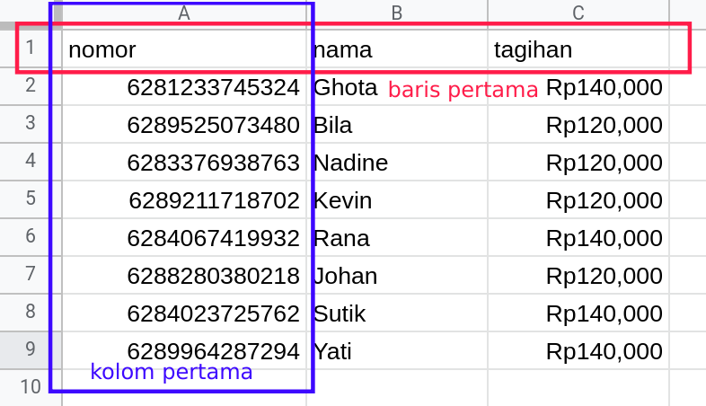

# Wabill

Kirim pesan WhatsApp unik ke banyak nomor sekaligus.

Klik [link ini](https://youtu.be/iQz-v9CCngE) untuk melihat video panduan instalasi dan penggunaan.

## Quickstart guide
1. Download dari Github
2. Jalankan aplikasinya
3. Buka halaman server
4. Scan kode QR
5. Buat data di Sheets/Excel
6. Buka halaman Client
7. Copy paste data tadi
8. Buat template
9. Klik preview
10. Kirim!

## Cara penggunaan
1. Jalankan server aplikasinya, ada dua cara untuk menjalankan aplikasi ini, menggunakan executable atau clone repo ini dan jalankan dengan `node index.js`.
Untuk menjalankan dengan executable, download aplikasi ini di bagian Release di samping kanan, sesuaikan dengan sistem operasi anda. Setelah itu klik dua kali (untuk windows), dan akan terbuka command prompt. Disitu akan keluar url, buka url tersebut di browser anda (saya pakai google chrome). Lalu scan kode qr nya, setelah aktif, buka halaman client di `url/client` contohnya `http://localhost:8000/client`.
2. Buat data di Google Sheet/Microsoft Excel

3. Salin dan tempel data, **Pastikan baris pertama adalah judul kolomnya, dan kolom pertama adalah nomor WhatsApp penerima (dengan format 62xxxxxxxx).**

4. Buat template, bungkus judul kolom dengan simbol **{}**, contoh template (sesuai data diatas):
>Pelanggan Yth,

>Bersama ini kami informasikan tagihan Wabill Anda {nomor} atas nama {nama}, bln tagihan 08-2021 sebesar {tagihan} akan jatuh tempo pada tanggal 05-09-2021.

>Mohon segera lakukan pembayaran agar Wabill Anda tdk terisolir.

>Abaikan notifikasi ini jika sudah melakukan pembayaran.

>Terima kasih
5. Cek preview terlebih dahulu
6. Kirim!

## Update
Aplikasi ini menggunakan libarary Baileys, yang bisa jadi di kemudian hari membutuhkan update. Anda bisa mendukung aplikasi ini dengan berdonasi melalui:
[Trakteer.id](https://trakteer.id/afarhansib) atau [Saweria](https://saweria.co/afarhansib) atau hubungi whatsapp saya di [wa.me/6281233745324](https://wa.me/6281233745324)

Dukungan anda akan sangat berarti bagi saya dan kelanjutan aplikasi ini :) 

**Aplikasi/tool ini gratis. mohon tidak diperjualbelikan!**

**Saya tidak mencatat/mengumpulkan data dari aplikasi ini.**

